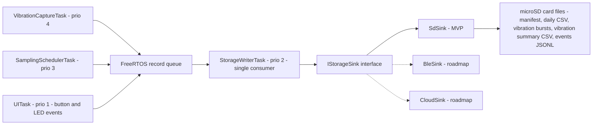

# Data flow

This document traces a record from the moment a sensor task produces it to
the moment it is a file on the SD card, and shows where the architecture
already anticipates offloading over BLE or WiFi without a rewrite. See
[ADR 0002](../adr/0002-microsd-storage-with-transport-abstraction.md) for
the decision behind the `IStorageSink` abstraction at the center of this
diagram, and [overview.md](overview.md) for the hardware each task talks
to.

## Pipeline diagram

`StorageWriterTask` is the single consumer of the record queue by design:
every producer task can push a record and move on without worrying about
file I/O timing, fsync stalls, or SD card contention, and the on-card
layout only has one writer to reason about.

## Walkthrough: one 1Hz sample

1. `SamplingSchedulerTask` wakes on its 1-second tick, reads both CT
   channels off the ADS1115, both AC-presence opto inputs, the four (or
   five) DS18B20 probes, and the MAX31855 thermocouple reading.
2. It checks the two current readings against a spike threshold. If
   neither channel is spiking, this is a normal sample: it packages
   currents, temperatures, and control-state into one record and pushes it
   onto the FreeRTOS record queue.
3. If a current channel is spiking, the scheduler still pushes this 1Hz
   record, and separately signals `VibrationCaptureTask` to start a
   trigger-on-event vibration burst (see below) so the transient is
   captured on both axes of evidence at once.
4. `StorageWriterTask` pops the record off the queue, hands it to whichever
   sink is active through the `IStorageSink` interface — `SdSink` in the
   MVP — and that sink appends it to the current day's channel CSV.
5. Roughly every 5 seconds, `StorageWriterTask` fsyncs the open file so
   that a power loss or card pull never costs more than a few seconds of
   data.

## Walkthrough: one vibration burst

1. `VibrationCaptureTask` runs its own windowed capture loop against the
   two ADXL345 pods, independent of the 1Hz scheduler, both on a periodic
   schedule and on trigger from `SamplingSchedulerTask`.
2. Each burst is captured into a ring buffer in PSRAM, since a raw burst at
   useful sample rates is too large to hold in the ESP32-S3's internal
   RAM alongside everything else.
3. The task computes RMS, peak, and band-energy summaries from the burst
   and pushes a lightweight summary record onto the FreeRTOS queue
   immediately — this is what ends up in the vibration summary CSV and is
   cheap enough to keep at high frequency.
4. If the burst was periodic or trigger-fired (not just a rolling window
   that decided nothing was interesting), the task also pushes the raw
   burst itself onto the queue as a binary record.
5. `StorageWriterTask` pops both record types the same way it pops
   channel-sample records: summaries go to the vibration summary CSV, raw
   bursts go to their own binary file, through the same `IStorageSink`.

## Walkthrough: a journal button press

1. `UITask` debounces the event button press and constructs an event
   record: an RTC timestamp and an event marker, no additional payload.
2. That record goes onto the same FreeRTOS queue as everything else — the
   journal path is not a special case at the queue or storage layer.
3. `StorageWriterTask` writes it to the JSONL event log through the active
   sink.
4. Enrichment, if any, happens later and out of band: the tech can scan a
   QR sticker on the enclosure to fill out a form with details or attach
   photos, and analysis correlates that submission to the nearest button
   timestamp after the fact. See
   [ADR 0006](../adr/0006-journaling-button-plus-qr-form.md).

## Where BLE and cloud offload fit

The dashed branches in the diagram above are not built yet. Because every
producer task already only knows about a queue, and `StorageWriterTask`
only knows about the `IStorageSink` interface, adding `BleSink` or
`CloudSink` later means writing a new sink implementation, not touching
any sensor task or the queue contract. See
[docs/roadmap.md](../roadmap.md) for where these land relative to other
post-MVP work.
