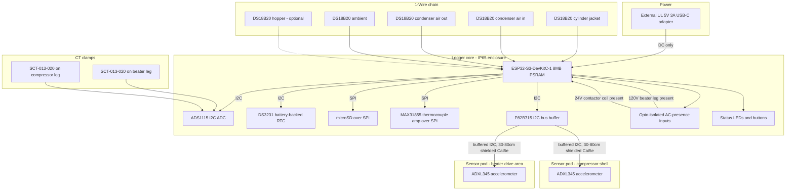

# Architecture overview

frosty-monitor is built as two physically and electrically separate pieces:
a **logger core** that holds all the electronics and is reused between
installs, and a set of **sensor pods** on detachable cables that sit inside
the machine and take the physical abuse. This split, and the reasoning
behind it, is recorded in
[ADR 0004](../adr/0004-modular-logger-core-plus-sacrificial-pods.md).

The core is built from an ESP32-S3-DevKitC-1 dev board plus off-the-shelf
breakouts, chosen for its built-in WiFi/BLE and PSRAM (see
[ADR 0003](../adr/0003-esp32-s3-devkitc-1-platform.md)), running PlatformIO
and the Arduino core over FreeRTOS (see
[ADR 0005](../adr/0005-firmware-framework-platformio-arduino.md)). It talks
to sensors over three buses — I2C, 1-Wire, and SPI — plus a handful of
opto-isolated digital inputs and a debounced drip-counter pulse input, and
it writes everything to a microSD card through a transport-abstracted
storage layer (see
[ADR 0002](../adr/0002-microsd-storage-with-transport-abstraction.md)).

## Block diagram

Everything above the enclosure line lives inside the IP65 box and is
reused install to install. Everything below it — the two accelerometer
pods, the CT clamps, the 1-Wire probes — is cheap, connectorized, and
expected to be sacrificed to grease and sugar contamination over the life
of the project.

## Subsystems

### Compute and control

An ESP32-S3-DevKitC-1 running FreeRTOS tasks over the Arduino core is the
single point of coordination for sampling, buffering, and storage. See
[ADR 0003](../adr/0003-esp32-s3-devkitc-1-platform.md) for why this board
over an RP2350 or STM32, and
[ADR 0005](../adr/0005-firmware-framework-platformio-arduino.md) for why
PlatformIO + Arduino rather than raw ESP-IDF.

### Current sensing

Two SCT-013-020 CT clamps — one on the beater motor leg, one on the
compressor leg — feed an ADS1115 I2C ADC. These are non-invasive
clamp-around sensors: no conductor is opened or spliced to install them,
though the install itself still requires the machine unplugged (see
[docs/safety.md](../safety.md)).

### Vibration sensing

Two ADXL345 accelerometers, one at the beater drive area and one on the
compressor shell, live in their own sensor pods and reach the core over a
buffered I2C bus (P82B715) run through 30-80cm of shielded Cat5e. Running
I2C that far needs active buffering to stay reliable; an RS-485 bridge with
a Seeed XIAO RP2040 in the pod is the documented fallback if the buffered
I2C link proves unreliable in the field. See
[ADR 0004](../adr/0004-modular-logger-core-plus-sacrificial-pods.md).

### Temperature sensing

Four DS18B20 1-Wire probes (cylinder jacket, condenser air-in, condenser
air-out, ambient, with a fifth optional hopper probe) run on a single
1-Wire chain. A K-type thermocouple on the compressor discharge line goes
through a MAX31855 amplifier over SPI, since discharge-line temperatures
exceed the DS18B20's practical range and accuracy at the temperatures of
interest.

### Leak sensing

An IR slot-type optical drop counter clipped to the drip tube outlet is a
base-config channel: it counts drops for a quantitative rear-seal-wear drip
rate, in place of pure inference from other channels. Two optional add-ons
extend this: a capacitive moisture pad under the machine/drip-tray footprint
(ADS1115 channel A2), and an experimental semiconductor refrigerant
gas-sensor pod low in the compressor compartment (ADS1115 channel A3) —
uncalibrated and pending bench validation, so the primary refrigerant-loss
signature remains the indirect one (short-cycling + reduced condenser ΔT).

### Control-state sensing

Opto-isolated digital inputs read AC presence directly off the 120V beater
leg and the 24VAC contactor coil, so the logger can tell not just "is the
compressor drawing current" but "is the control chain asking it to run."
Optional taps on the TCC microswitch and high-pressure switch nodes are
included in the channel budget but not required for a base install.

### Storage

All sampled data passes through a single FreeRTOS queue to a storage
writer task, which emits it through the `IStorageSink` interface to a
microSD card in the MVP. See
[ADR 0002](../adr/0002-microsd-storage-with-transport-abstraction.md) and
[data-flow.md](data-flow.md) for the full path from sensor to file.

### Power

The only thing that enters the enclosure is regulated 5V DC from an
external UL-listed USB-C wall adapter, plugged into a wall outlet separate
from the machine's own circuit. No line voltage is present anywhere inside
the logger core. See [docs/safety.md](../safety.md).
