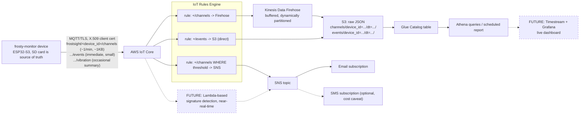

# Cloud architecture — premium real-time tier

> **Status: design doc for an unapplied skeleton.** Nothing described here
> is deployed. The Terraform that implements it lives in
> [cloud/terraform/](../../cloud/terraform/) and has never been `apply`'d
> against a real AWS account — see [cloud/README.md](../../cloud/README.md)
> for the status banner and bring-up steps. This document describes the
> intended design and the reasoning behind it, for review before any of it
> becomes real infrastructure.

This is the cloud side of frosty-monitor's premium tier: devices that
already work standalone (SD card, `IStorageSink`, the whole MVP — see
[docs/architecture/data-flow.md](../architecture/data-flow.md)) also
publish a lightweight, aggregated copy of their data to AWS IoT Core over
MQTT/TLS, for fleet-wide visibility and near-real-time alerting on top of
the SD card, not instead of it. The device side of that connection — what
gets published, when, and how the device handles being offline — is
[docs/firmware/connectivity.md](../firmware/connectivity.md), written
concurrently with this document and cross-referenced rather than
duplicated here.

## Diagram

Solid edges are what [cloud/terraform/](../../cloud/terraform/) actually
declares. Dashed edges/boxes (Timestream+Grafana, Lambda-based signature
detection) are explicitly **not built** — see
[Dashboard options](#dashboard-options), below, and
[docs/roadmap.md](../roadmap.md) item 2 for where signature detection
currently lives (the `analysis/` offline pipeline, not the cloud path).

## Why store-and-forward, SD as source of truth

The cloud path is a **best-effort, backfillable copy**, not a durability
guarantee. This is a deliberate consequence of how the device side is
built, not a limitation this document is working around:

- The SD card is written by `StorageWriterTask` through the
  `IStorageSink` abstraction regardless of network state — see
  [ADR 0002](../adr/0002-microsd-storage-with-transport-abstraction.md)
  and [docs/architecture/data-flow.md](../architecture/data-flow.md). A
  frozen-drink machine's install environment (kitchens, walk-ins,
  intermittent WiFi at best, no wired network) means a device that
  *required* connectivity to keep logging would lose data constantly. It
  doesn't; connectivity is additive.
- Per
  [docs/firmware/connectivity.md](../firmware/connectivity.md), the
  device's MQTT publish path is a secondary consumer of the same records
  that already land on the card — never the only place a record exists
  before it's durable.
- Consequently, this cloud pipeline can lose messages (a rule
  misconfiguration, a Firehose outage, an over-quota month, whatever) and
  the *worst* case is a gap in the near-real-time/fleet-dashboard view
  until the device is physically revisited and its SD card pulled — not
  lost data. Nothing about the premium tier's value proposition depends
  on the cloud copy being complete; it depends on it being *timely* when
  it does arrive.
- This also means backfill is a card-pull away, not a re-engineering
  project: the on-card format
  ([docs/firmware/data-format-spec.md](../firmware/data-format-spec.md))
  is already the full-resolution 1Hz record; the cloud copy is a lossy,
  aggregated 1-minute rollup of the same channels by design (see
  [What "real-time" means here](#what-real-time-means-here)).

## Security model

- **Per-device X.509 certificates, no shared credentials.** Every device
  gets its own certificate/key pair, minted by
  [cloud/scripts/provision-device.sh](../../cloud/scripts/provision-device.sh)
  at provisioning time via `aws iot create-keys-and-certificate` — never
  a fleet-wide shared secret, and never generated or held anywhere except
  that one API response and the device's own `/certs/` on its SD card.
  Terraform never touches individual device certificates (see the
  comment at the top of
  [cloud/terraform/iot_core.tf](../../cloud/terraform/iot_core.tf)) —
  keeping per-device key material out of Terraform state entirely is a
  feature, not a gap.
- **Least-privilege topic scoping via IoT policy variables.** The one
  shared IoT policy every device's certificate is attached to
  (`cloud/terraform/iot_core.tf`) scopes `Connect`/`Publish`/`Subscribe`/
  `Receive` to `frostsight/${iot:Connection.Thing.ThingName}/*` and a
  matching client ID — resolved *by IoT Core* against the certificate
  presented at connect time, not by anything the device claims in its
  payload. A compromised or physically extracted device certificate can
  only ever read or write that one device's own topic namespace; it
  cannot masquerade as another device or snoop on another device's data.
- **Revocation is per-device and immediate.** Because every device has
  its own certificate, compromising or decommissioning one unit means
  deactivating/deleting exactly its certificate
  (`cloud/scripts/deprovision-device.sh`) without touching any other
  device's ability to connect.
- **TLS in transit, encryption at rest.** MQTT connections are TLS-only
  (AWS IoT Core doesn't offer a plaintext option on the standard
  endpoint); the S3 landing bucket has default SSE-KMS encryption and is
  fully blocked from public access (`cloud/terraform/ingest.tf`).
- **No device-to-device or device-to-fleet visibility.** A device's IoT
  policy grants it no `Subscribe`/`Receive` rights outside its own
  namespace, so even if a future feature adds a command-and-control or
  shadow channel, today's policy shape has no path for one device to see
  another's traffic.

## Multi-tenancy / fleet-view considerations

The premium tier's value is fleet-wide and per-customer visibility, which
this design accounts for even though nothing multi-tenant is enforced at
the infrastructure layer yet (see the honest caveat in
[Dashboard options](#dashboard-options)):

- **Device naming convention: `site-machine`.** Thing names (and
  therefore the `frostsight/<device_id>/*` topic namespace, and the
  `device_id` partition value in S3/Glue/Athena) are expected to follow a
  `<site>-<machine>` shape — e.g. `delta117a-001`, encoding which
  customer/location and which physical unit without a separate lookup
  table being load-bearing for basic fleet navigation. This is a
  *convention*, enforced loosely by
  `cloud/scripts/provision-device.sh`'s name validation, not a hard
  schema constraint — nothing in IoT Core or the Glue table parses
  structure out of `device_id`.
- **Isolation today is at the IoT policy layer, not the query layer.**
  Every device is scoped to its own MQTT topic namespace (see
  [Security model](#security-model)), but the S3/Glue/Athena query layer
  is currently one shared table across the whole fleet — there is no
  per-customer IAM boundary on read access to Athena today. That's
  appropriate for a single-operator MVP (Ben, or a small ops team,
  querying across the whole fleet) and **not** appropriate as-is if/when
  a customer or distributor gets their own login to see only their own
  machines.
- **The intended next step, when that's needed:** per-customer Athena
  *views* (`CREATE VIEW customer_delta AS SELECT * FROM channels WHERE
  device_id LIKE 'delta%'`, or a proper join against a customer/device
  mapping table once one exists) rather than per-customer copies of the
  data or per-customer S3 buckets — the underlying table and partitioning
  scheme don't need to change, only what's exposed to whom. This is
  explicitly not built in `cloud/terraform/` yet; it's a query-layer
  addition for whenever the first distributor-tier customer actually
  needs their own restricted view, not before.

## Dashboard options

Compared honestly, not as a foregone conclusion toward whatever's already
built:

| Option | What it gets you | Cost/complexity | Caveat |
|---|---|---|---|
| **Athena + scheduled report** (what `cloud/terraform/query.tf` sets up for) | SQL over all fleet data, a scheduled query (or just a periodic manual one) producing a report | Lowest — no additional service to run or pay for beyond Athena's per-query-scanned pricing | Not a live dashboard; someone runs/schedules a query and reads a table or emailed report. Fine for "how's the fleet doing this week," not for "watch this machine right now." |
| **Athena + Amazon QuickSight** | An actual clickable dashboard over the same Athena tables | Low-moderate — QuickSight has its own per-user/session pricing on top of Athena | Still not sub-minute live (QuickSight refreshes on a schedule or on-demand, not streaming) but a real step up in usability over raw SQL. |
| **Amazon Managed Grafana** (over Athena or another source) | A proper ops-style live dashboard, alerting panels, the tool most people picture when they say "dashboard" | Moderate — Managed Grafana bills per active user per month, plus whatever it queries | Worth it once someone is actually paying for "watch my machine live," not before there's a customer asking for that. |
| **Amazon Timestream + Grafana** | Purpose-built time-series storage feeding Grafana — the "real" live-dashboard architecture | Higher — a second, always-on storage service in addition to S3/Glue, plus Managed Grafana | This is the dashed future branch in the diagram above. Deliberately **not built** in this skeleton (see the task constraint: no Timestream/Grafana resources) — it only earns its keep once live per-second-ish visualization is a sold feature, not a nice-to-have. Adding it later doesn't require re-architecting ingest: it's a second Firehose destination (or a Lambda writing to Timestream) fed from the same IoT rule, additive to what's already here. |
| **Third-party IoT dashboard SaaS** (e.g. a fleet-monitoring platform that ingests via MQTT or a REST API) | Fast to stand up, often includes fleet-management features (device provisioning UI, alert routing) out of the box | Subscription cost, and a third party now has device telemetry | Worth evaluating **if** the team decides they don't want to own dashboard/ops tooling at all — genuinely reasonable for a small team, but a build-vs-buy decision that belongs to Ben, not something this skeleton presumes. Not pursued here because it's an external-dependency decision, not an infrastructure-design one. |

**Recommendation for this tier's MVP: start with Athena + a scheduled
report.** It's what's already built in `cloud/terraform/query.tf`, it
costs essentially nothing beyond what the ingest pipeline already costs
(see [cloud/README.md](../../cloud/README.md)'s cost model), and it
matches what's actually been sold so far: fleet visibility and
alerting, not a live per-second dashboard. **Add Grafana (Managed
Grafana over Athena/S3 first; Timestream+Grafana only if per-second-ish
live view is specifically what's being sold) once there's a real "I want
to watch this machine live" customer ask** — not speculatively. This
mirrors the same discipline the rest of this project applies elsewhere
(see [docs/roadmap.md](../roadmap.md)'s framing of the whole cloud tier
as "gold-plating until field value is proven").

## What "real-time" means here

Worth being explicit about, since "real-time" means different things to
different people and this tier is not literally real-time in every sense:

- **Trend data (channel currents, temperatures, drip rate, control
  state): 1-minute aggregates.** The `channels` topic carries a
  mean/min/max rollup per channel per minute (see the payload shape
  documented — with a loud "provisional, sync with connectivity.md"
  warning — in
  [cloud/terraform/query.tf](../../cloud/terraform/query.tf)), not a
  live per-second feed. A dashboard built on this data is "what's this
  machine doing right now, to within about a minute," which is
  appropriate for the failure signatures this project cares about
  (short-cycling, drip-rate trends, temperature drift) — none of which
  need sub-minute resolution to detect.
- **Events: within seconds.** Button presses, system events, triggers,
  and errors (`.../events`) are published immediately on occurrence, not
  batched into the minute rollup — Firehose's buffering is deliberately
  bypassed for this topic (see the "why direct-to-S3" comment in
  `cloud/terraform/ingest.tf`) so an event reaching IoT Core shows up in
  S3 within roughly the time it takes one small IoT rule + S3 PUT to
  execute, typically low single-digit seconds.
- **Raw vibration data stays on-device/SD, full stop.** Only vibration
  *summary* statistics (RMS/peak/band-energy per burst, per
  [docs/firmware/data-format-spec.md](../firmware/data-format-spec.md))
  are candidates for the `.../vibration` topic, and even that's not yet
  wired into `cloud/terraform/ingest.tf` (see the note at the bottom of
  that file). The raw waveform `.bin` captures that `VibrationCaptureTask`
  writes are never intended to leave the SD card over this pipeline —
  they're too large for a ~1KB/minute-class MQTT budget, and nothing
  about fleet-wide alerting or trend visibility needs the raw waveform
  off the card; a technician pulling the card (or, per
  [docs/roadmap.md](../roadmap.md) item 3, a future BLE offload) is the
  path for raw vibration data, not this cloud tier.

So: "real-time" in frostsight's premium tier means *the trend and event
picture is current to within about a minute, cheaply, for the whole
fleet* — not a live oscilloscope view of every accelerometer sample. That
scope is what keeps this tier's cost near-zero per device (see
[cloud/README.md](../../cloud/README.md)) and is a decision to revisit
explicitly, not by accretion, if a customer ever needs more than that.
