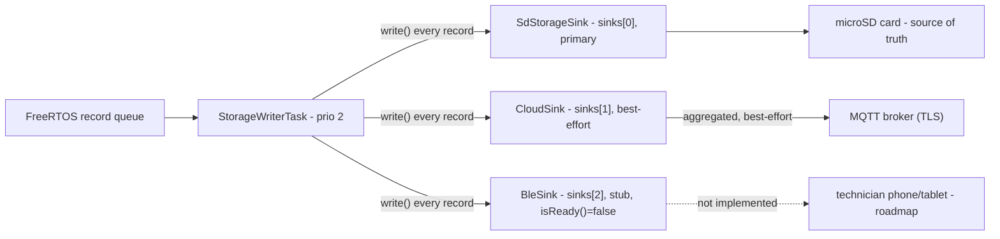
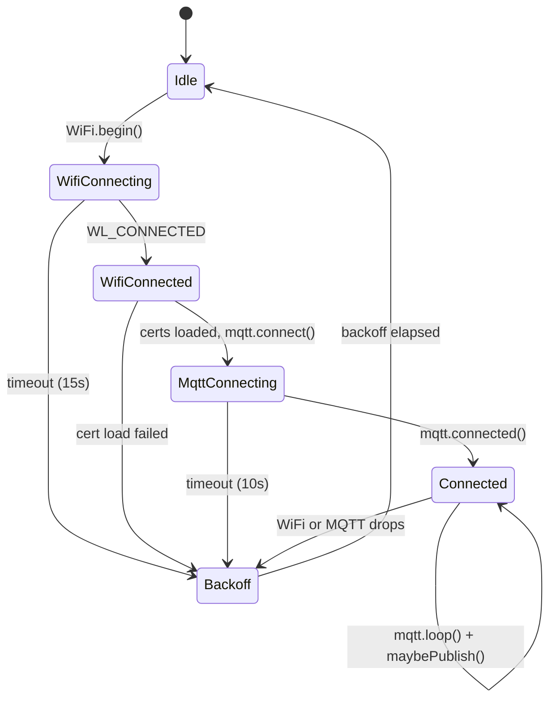

# Firmware connectivity: multi-sink storage, CloudSink, and the BLE roadmap

This document covers the "real-time remote monitoring" premium tier and the
BLE walk-up offload tier at the firmware level: the multi-sink tee that
makes SD, cloud, and (eventually) BLE independent destinations for the same
record stream, the `CloudSink` implementation that exists today, and the
`BleSink` design that doesn't (yet).

For the base pipeline this builds on -- tasks, queue, `IStorageSink`, SPI
sharing, power-loss resilience -- see
[architecture.md](architecture.md). For the on-card record shapes referenced
throughout (`ChannelRow`, `VibSummary`, `Event`), see
[data-format-spec.md](data-format-spec.md); the cloud JSON schemas below are
derived from those same records, not a separate format.

## Multi-sink tee architecture

`StorageWriterTask` is still the single consumer of the FreeRTOS record
queue -- that part of the design (see
[architecture.md](architecture.md#storagewritertask-priority-2)) is
unchanged. What changed is what's on the other side of that queue: instead
of one `IStorageSink`, `AppContext` now holds a small fixed-size array of
them (`AppContext::sinks`, capacity 3 today: SD, Cloud, BLE), and every
record is offered to each one in turn.



Key properties, all enforced in `tasks/storage_writer.cpp`:

- **SD is index 0 and is the source of truth.** Every other sink is
  best-effort. A sink's `write()`/`flush()` failing, blocking briefly, or
  simply not being ready (cloud disabled, BLE unimplemented) must never
  affect any other sink -- the loop calls every sink unconditionally and
  swallows the per-call result, it does not short-circuit.
- **`SampleRecord` is still POD, copied off the queue once per record** (see
  `storage/record_types.h`). Every sink gets the same copy; for the one
  record type with an owned heap pointer (`VibBurst::data`), exactly one
  sink is allowed to `free()` it -- see
  [Raw vibration bursts stay on SD only](#raw-vibration-bursts-stay-on-sd-only)
  below. This is a contract between sink implementations, not something the
  tee loop itself enforces.
- **CloudSink's WiFi/MQTT connection work never runs on `StorageWriterTask`.**
  See [CloudSink state machine](#cloudsink-state-machine) below for why and
  where it actually runs.

## CloudSink

`storage/cloud_sink.{h,cpp}` implements `IStorageSink`. It is **disabled by
default** -- see [Configuration](#configuration) -- and when disabled it
touches no hardware at all: no `WiFi.begin()`, no TLS setup, `isReady()`
always `false`, `write()`/`flush()`/`poll()` are immediate no-ops.

The aggregation math it depends on (`ChannelRow`/`VibSummary` accumulation,
JSON serialization) lives in `storage/cloud_aggregate.{h,cpp}`, which is
deliberately Arduino-free and unit tested in `[env:native]`
(`pio test -e native`, `test/test_native/test_main.cpp`). `cloud_sink.{h,cpp}`
itself is guarded with `#ifdef ARDUINO` and is not part of the native
`build_src_filter` in `platformio.ini` -- the guard is belt-and-suspenders
documentation of that split, not something the native build actually
exercises today.

### Configuration

`config.json` gains an optional `"cloud"` object. Every field is optional
and defaults to the value below (so an old `config.json` with no `"cloud"`
key at all behaves exactly like an explicit
`{"cloud":{"enabled":false}}`):

```json
{
  "cloud": {
    "enabled": false,
    "wifi_ssid": "",
    "wifi_pass": "",
    "mqtt_host": "",
    "mqtt_port": 8883,
    "client_id": "",
    "topic_prefix": "frostsight",
    "publish_interval_s": 60,
    "ca_path": "/certs/ca.pem",
    "cert_path": "/certs/device.pem",
    "key_path": "/certs/device.key"
  }
}
```

Parsed in `tasks/config_loader.cpp` into `AppConfig::cloud`
(`CloudConfig`, `storage/cloud_config.h`). If `client_id` is left empty, it
falls back to the deployment's `deployment_id` so a technician doesn't have
to set the same identifier twice. `main.cpp` constructs `CloudSink` with the
*effective* config, after `ConfigLoader::loadOrDefault()` has run, and calls
`begin()` unconditionally -- `begin()` itself is what checks `enabled` and
either does nothing or starts the background task described next.

### CloudSink state machine

`CloudSink::poll()` is a small non-blocking-per-call state machine. It is
**not** pumped from `StorageWriterTask`. `PubSubClient::connect()` and
`::publish()` are blocking calls -- a TCP+TLS handshake can take seconds on
a bad link -- and `StorageWriterTask` must never stall (SD's flush cadence
is the direct knob on power-loss data exposure; see
[architecture.md#power-loss-resilience](architecture.md#power-loss-resilience)).
Instead, `CloudSink::begin()` spawns its own low-priority FreeRTOS task
(priority 1, same tier as `UITask`) that calls `poll()` every 250ms. Only
`write()` (a quick float-accumulation into the aggregators, guarded by a
short-held mutex) runs on `StorageWriterTask`.



Backoff is exponential with a floor and a ceiling: starts at 2s, doubles on
each failed attempt, caps at 5 minutes, and resets to 2s on the next clean
`MqttConnecting -> Connected` transition. There is no cap on the number of
retries -- a cloud-enabled unit that never has connectivity just backs off
to a steady 5-minute retry cadence forever, which is cheap enough not to
bother disabling.

### Publish policy

| Record type | Cloud handling | Topic |
|---|---|---|
| `ChannelRow` (1Hz) | Aggregated (mean/min/max per numeric channel, last-value per bool) over `publish_interval_s`, one JSON message per window | `<topic_prefix>/<client_id>/channels` |
| `VibSummary` (per burst, both pods) | Aggregated per pod over the same window; only published if at least one summary landed in the window | `<topic_prefix>/<client_id>/vibration` |
| `Event` | Published **immediately**, not aggregated -- same JSON shape as the on-card `events_YYYYMMDD.jsonl` line (see [data-format-spec.md](data-format-spec.md#events_yyyymmddjsonl)) | `<topic_prefix>/<client_id>/events` |
| `VibBurst` (raw) | **Never published.** SD only. | n/a |

"Real-time" here means minutes for trends (the aggregation window) and
seconds for events (published as they happen), not milliseconds -- streaming
every 1Hz sample or every raw vibration burst live would cost far more
bandwidth than the trend data is worth. See
[Bandwidth and cost](#bandwidth-and-cost) below for the numbers behind that
call.

#### Channels aggregate JSON

`ts_iso`/`ts_unix_ms` are the **window-end** timestamp (the last row folded
in), not the window start. `n` is the number of `ChannelRow` samples folded
into the window. A numeric channel with zero non-NaN samples in the window
(e.g. `temp_hopper_c` on a deployment with no hopper probe) is **omitted
from the JSON entirely**, not emitted as `null` or `0` -- same "missing
sensor" convention as the CSV, just expressed as key absence instead of an
empty field. The four boolean state channels always appear (last-sample
value, not something meaningful to average).

```json
{
  "ts_iso": "2026-09-14T12:01:00Z",
  "ts_unix_ms": 1768392060000,
  "window_s": 60,
  "n": 58,
  "current_beater_a": {"mean": 2.145, "min": 1.980, "max": 2.310},
  "current_compressor_a": {"mean": 6.402, "min": 0.000, "max": 7.850},
  "temp_cylinder_c": {"mean": -4.220, "min": -4.500, "max": -3.900},
  "temp_cond_in_c": {"mean": 24.100, "min": 23.800, "max": 24.400},
  "temp_cond_out_c": {"mean": 31.500, "min": 30.900, "max": 32.100},
  "temp_ambient_c": {"mean": 22.300, "min": 22.100, "max": 22.500},
  "temp_discharge_c": {"mean": 88.400, "min": 82.100, "max": 91.200},
  "drip_rate_cpm": {"mean": 0.000, "min": 0.000, "max": 0.000},
  "beater_on": true,
  "compressor_cmd": true,
  "tcc_satisfied": true,
  "hp_ok": true
}
```

(`temp_hopper_c`, `moisture_raw`, `refrigerant_raw` are omitted in this
example -- unpopulated optional probes on this deployment, all-NaN for the
window.)

#### Vibration aggregate JSON

One message per pod per window (only sent if that pod produced at least one
`VibSummary` in the window -- at the field default `vib_capture_interval_s`
of 300s, that's roughly one message per pod every 5 minutes, not every
`publish_interval_s`).

```json
{
  "ts_iso": "2026-09-14T12:05:00Z",
  "ts_unix_ms": 1768392300000,
  "window_s": 60,
  "n": 1,
  "pod_id": 1,
  "rms_x_g": {"mean": 0.182, "min": 0.182, "max": 0.182},
  "rms_y_g": {"mean": 0.095, "min": 0.095, "max": 0.095},
  "rms_z_g": {"mean": 0.210, "min": 0.210, "max": 0.210},
  "peak_x_g": {"mean": 0.640, "min": 0.640, "max": 0.640},
  "peak_y_g": {"mean": 0.410, "min": 0.410, "max": 0.410},
  "peak_z_g": {"mean": 0.720, "min": 0.720, "max": 0.720},
  "band_low_g2": {"mean": 0.032, "min": 0.032, "max": 0.032},
  "band_mid_g2": {"mean": 0.011, "min": 0.011, "max": 0.011},
  "band_high_g2": {"mean": 0.004, "min": 0.004, "max": 0.004}
}
```

#### Event JSON

Identical shape to an `events_YYYYMMDD.jsonl` line -- `CloudSink` calls the
same `record_format::formatEventJsonl()` SD uses, it just also publishes the
result instead of only appending it to the file:

```json
{"ts_iso":"2026-09-14T12:03:41Z","ts_unix_ms":1768392221000,"type":"trigger","detail":{"reason":"current_spike"}}
```

### Raw vibration bursts stay on SD only

`CloudSink::write()` returns `false` immediately for `RecordType::VibBurst`
without touching `record.vibBurst.data` at all. Two reasons, one structural
and one about bandwidth:

- **Ownership.** Per the `VibBurst` ownership contract in
  `storage/record_types.h`, exactly one sink may `free()` the buffer. SD
  (`sinks[0]`) is that sink; `CloudSink` (and `BleSink`) must never touch it.
- **Size.** A single burst is `n_samples x n_axes x 2 bytes` -- at the
  default 400Hz/2s/3-axis burst that's ~4.8KB, and periodic bursts land
  roughly every 5 minutes per pod (see the
  [storage budget table](architecture.md#storage-budget), ~11MB/day for
  vibration bursts total). Publishing that live, continuously, per pod,
  would dominate the cloud bandwidth budget for data whose trend (RMS/peak/
  band-energy) is already captured in the much smaller `VibSummary`
  aggregate above. A burst that's genuinely worth pulling off-device gets
  pulled deliberately (BLE walk-up, or a future authenticated on-demand
  cloud fetch) not streamed by default.

### TLS / certificate provisioning

`CloudConfig::{ca_path,cert_path,key_path}` point at PEM files on the SD
card (default `/certs/ca.pem`, `/certs/device.pem`, `/certs/device.key`),
loaded via `SD.h` (guarded by the same `sdSpiMutex()` every other SD access
in this codebase uses) the first time a connection attempt needs them, then
cached in memory for the life of the process.

Provisioning those files onto the card is out of scope for firmware itself
-- it's a bench-time step, done by the cloud provisioning tooling (device
identity issuance, cert signing) documented in `cloud/README.md` at the repo
root. The firmware-side contract is just: if `cloud.enabled` is `true` and
those three files aren't present and valid at `beginMqttConnect()` time,
`CloudSink` logs a failure and backs off like any other connect failure --
there is no separate "no certs" error path, a missing cert is just another
reason the MQTT handshake doesn't succeed yet.

### Watermark / offline backfill (M2)

Every successful publish updates an in-memory
"last-published-ts-per-stream" watermark and mirrors it to
`/cloud_watermark.json` on the SD card:

```json
{"channels": 1768392060000, "vibration": 1768392300000, "events": 1768392221000}
```

This is loaded once at `begin()` so a reboot doesn't lose track of where
publishing left off. **What it does not do yet is anything with that
information** -- there is no code today that walks SD files older than the
watermark and republishes what was missed while the unit was offline.
`CloudSink::backfillFromSd()` is the stubbed hook for that (called once per
successful reconnect, currently a documented no-op) --
`// TODO(M2)` in `storage/cloud_sink.cpp`. Deferred deliberately: a correct
backfill needs a design pass on how far back to look, how to interleave
replay with live publishes without starving either, and how to chunk a
multi-file replay across many `poll()` calls so it doesn't become its own
blocking operation -- none of which is worth committing to before M1 bench
bring-up validates the live path first.

## BLE walk-up offload (lower tiers, planned)

Lower product tiers that don't include always-on cloud connectivity still
need a way to get data off the unit without pulling the SD card. The planned
answer is a BLE GATT service a technician's phone/tablet connects to during
a walk-up visit:

- **File list characteristic** -- enumerates the files currently on the
  card the same way `manifest.json` describes the deployment: filenames,
  sizes, and rough date coverage, so the app can show "here's what's
  available" without transferring anything yet.
- **Chunked file transfer characteristic** -- requests and streams one file
  at a time in BLE-MTU-sized chunks (a raw `.bin` burst, a day's CSV,
  whatever the app asks for), reusing the same "every record/file is an
  independently transmittable unit" property the on-card format already
  guarantees (see [data-format-spec.md](data-format-spec.md#design-constraints)).
  No new on-card format needed -- BLE offload transfers exactly the files
  that already exist.
- Built on **NimBLE-Arduino** (not the stock BluedroidBLE stack -- smaller
  flash/RAM footprint, matters more on a tier that may not have PSRAM
  headroom to spare).

None of this is implemented. `storage/ble_sink.h` is a header-only stub
(`isReady()` always `false`, `write()`/`flush()` no-ops) that exists only so
the multi-sink tee has a second, free concrete sink to exercise today; it
deliberately does not add a NimBLE-Arduino dependency (`lib_deps`) ahead of
actually building this, to avoid paying that library's build-time/flash cost
on every build in the meantime. See `docs/architecture/data-flow.md#where-ble-and-cloud-offload-fit`
for how this fits the wider "any transport is a new sink" architecture
decision ([ADR 0002](../adr/0002-microsd-storage-with-transport-abstraction.md)).

## Bandwidth and cost

Approximate steady-state MQTT bandwidth at default settings
(`publish_interval_s = 60`, field `vib_capture_interval_s = 300`, one
deployment), using decimal units (1 KB = 1000 B) and a 30-day month:

| Stream | Cadence | Approx. message size | Daily volume | Monthly volume |
|---|---|---|---|---|
| `channels` aggregate | 1/min | ~0.7 KB | ~1.0 MB | ~30 MB |
| `vibration` aggregate | ~1/5min per pod, 2 pods | ~0.6 KB | ~0.35 MB | ~10 MB |
| `events` | event-driven, rare (button presses, triggers, faults) | ~0.1-0.2 KB | negligible | negligible |
| **Total (cloud)** | | | **≈ 1.4 MB/day** | **≈ 40-45 MB/month** |
| Raw vibration bursts (SD only, never published) | ~1/5min per pod, 2 pods | ~4.8 KB | ≈ 11 MB (SD only) | n/a -- never leaves the card |

The rule of thumb this table backs up: **one ~1KB message/min, continuously,
is about 43MB/month** (`1000 B x 1440 min/day x 30 day ≈ 43.2 MB`) --
roughly what the `channels` stream alone costs at its default cadence.
Everything else here is a smaller addition on top of that baseline, and the
single largest volume in the system (raw vibration bursts, comparable in
size to the entire rest of the daily SD budget -- see
[architecture.md#storage-budget](architecture.md#storage-budget)) is exactly
the piece that deliberately never goes over MQTT. That's the whole reason
the split in [Publish policy](#publish-policy) exists: pay cloud bandwidth
for trend data that's actually consumable in near-real-time on a dashboard,
keep the big, detailed-but-rarely-needed data local where storage is
effectively free (weeks of deployment against years of card capacity, see
the same storage budget table) and pull it deliberately (BLE walk-up, or a
future authenticated on-demand fetch) when it's actually wanted.
